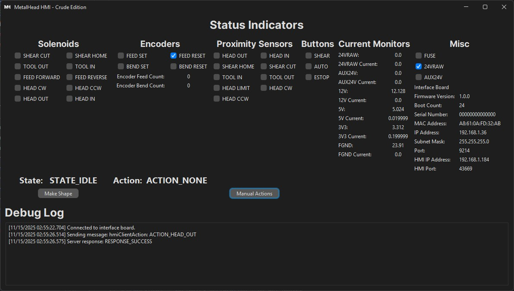
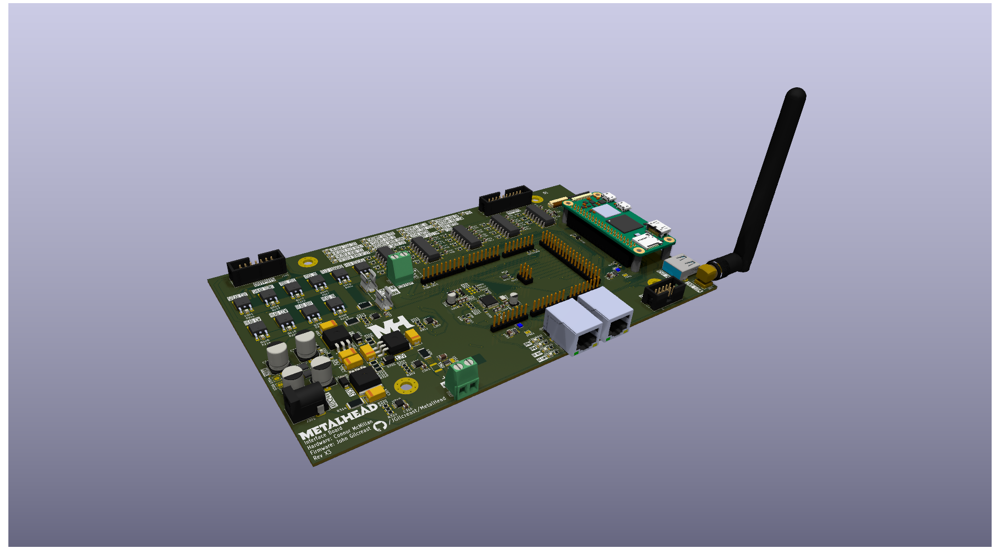
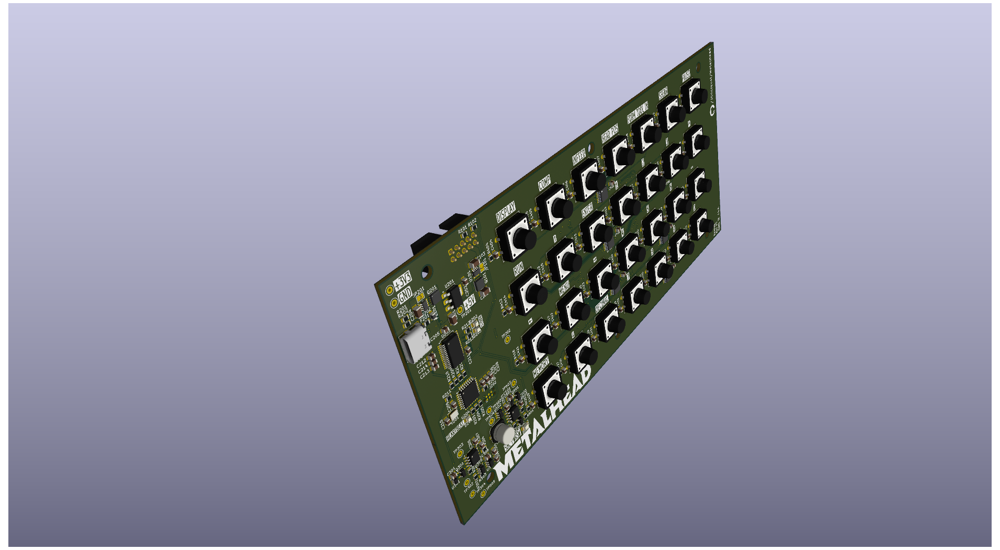

An opensource firmware and software drop-in replacement for the 85V Automatic Stirrup Bender by CRS Specialties Inc.
...short story behind the name...

# System Block Diagram

---

# Firmware
### HMI - Zephyr RTOS
* It's preferred to use CLion, 
* [Download](https://apps.microsoft.com/search?query=python&hl=en-US&gl=US) and install the latest version of python
* Install wget and 7Zip so that they're accessible via cmd:
  * `choco install wget 7zip`
* Verify python is accessible via cmd:
  * `python -V`
* Create python virtual environment
  * `cd MetalHead\firmware\interface-board-zephyr`
  * `python -m venv .\.venv`
* Enter python virtual environment
  * `.\.venv\Scripts\activate.bat`
* Update pip (optional)
  * `python.exe -m pip install --upgrade pip`
* Install west
  * `pip install west`
* Initiate the Zephyr-RTOS project
  * `west init`
* Set BOARD to rpi-pico
  * `west config zephyr.board rpi_pico`
* Pull the latest commits from Zephyr's github
  * `west update`
* Export a Zephyr CMake package. This allows CMake to automatically load boilerplate code required for building Zephyr applications.
  * `west zephyr-export`
  * > See: Computer\HKEY_CURRENT_USER\Software\Kitware\CMake\Packages
* Install additional packages need by west
  * `west packages pip --install`
* Install the Zephyr SDK
  * `west sdk install`
* Create a folder for bossac: C:\Program Files (x86)\BOSSA
* Copy bossac.exe to C:\Program Files (x86)\BOSSA
* Add C:\Program Files (x86)\BOSSA to PATH environment (use `sysdm.cpl`)
  * Make sure you can access bossac.exe. Open a new terminal and run: `bossac --help`
* Copy bossac.py from `MetalHead\firmware\interface-board-zephyr` to `MetalHead\firmware\interface-board-zephyr\zephyr\scripts\west_commands\runners`
* Start CLion
* Open our project: MetalHead\firmware\interface-board-zephyr\application
* Configure python interpreter for west
  * Go to File -> Settings -> Languages & Frameworks -> Python
  * Select the python interpreter from the list

To build a pristine copy of the firmware binary:[.gitignore](.gitignore)

  * `cd MetalHead\firmware\interface-board-zephyr`
  * `rmdir /q /s application\build`
  * Go back to CLion and reload West
  * Build, flash, etc

---

# Software
### HMI - Crude Edition

This is a simple unpolished version of the HMI app that will eventually run on the orange pi.
This version is mostly for implementation and testing purposes.
### HMI
The polished version of the HMI app. This app version be able to accomplish the following:
* Must be able to communicate with the interface board bi-directionally
* Display all relevant information in realtime.
* Recognize user input from the custom keypad
* Offer simple 'wizards' that visually guide operators to make common shapes

Nice to have features:
* Auto-update HMI software by communicating to a remote server
* Auto-update interface firmware by communicating to a remote server
* Include a section for custom stirrup calculators/guides
* Include instructional videos on using the machinery

---

# Hardware
### Interface Board

### Keypad
