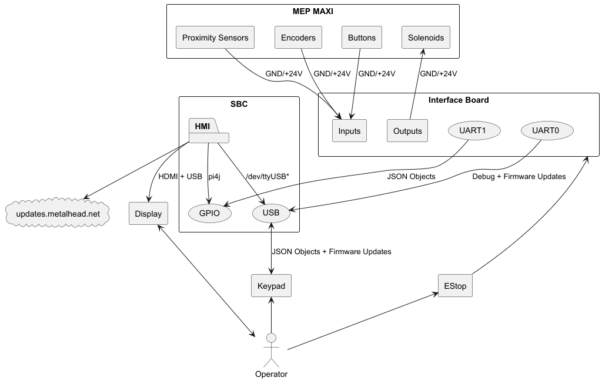

What is MetalHead and the short story behind the name

# System Block Diagram


---

# Firmware
## Interface Board
We are using [ArduinoJson](https://arduinojson.org/) to serialize and deserialize json objects between the Interface
Board and HMI. All JSON objects will have `ObjectType` to identify the type of message being transferred or received.
This will make it easy to deserialize a JSON object into one of our own objects.
### Recipe
The following JSON object is used inside of `PresetRecipes`
```json
{
  "ObjectType": "Recipe",
  "Lines": [[0,0,0,0,0], [], [], [], [], ...],
  "rebarSize": 0,
  "name": "12x12 Square",
  "desc": "A basic 1 x 1' square stirrup",
  "note": "Add some compensation for #5 or #6",
  "date": 1739089653
}
```
### PresetRecipes
The following JSON object is transferred to the HMI from the Interface Board via UART.
This object holds all preset recipes saved in the EEPROM.
> We could also implement this into the HMI application 
```json
{
  "ObjectType": "PresetRecipes",
  "NumofRecipes": 16,
  "Recipes": [Recipe{}, Recipe{}, ...]
}
```
### PresetRecipe
The following JSON object is transferred to the Interface Board from the HMI UART.
This object holds a recipe that the operator wishes to save.
```json
{
  "ObjectType": "PresetRecipe",
  "Recipe": {}
}
```
### ManualRecipe
The following JSON object is transferred to the Interface Board from the HMI via UART.
This object instructs the interface to make the following recipe.
```json
{
  "ObjectType": "ManualRecipe",
  "Recipe": {}
}
```
### StopEvent
The following JSON object is transferred to the HMI from the Interface Board via UART.
This object instructs the HMI to display a message. There are currently two types of events.
```json
{
  "ObjectType": "StopEvent",
  "Event": "EStop"
}
```
```json
{
  "ObjectType": "StopEvent",
  "Event": "Fuse"
}
```
---
## Keypad
Similarly to the Interface Board, we are using [ArduinoJson](https://arduinojson.org/) to serialize and deserialize
json objects between the Keypad and HMI
### KeypadEvent - Structure
KeypadEvent is sent to the Interface Board via UART when the operator hits a key. Multiple KeypadEvent[s] will be sent
to the Interface Board if the operator depresses a key for longer than a typical keystroke. Below are a few examples of
what a KeypadEvent structure sent via UART to the Interface Board would look like. Since the Keypad communicates to the
HMI uni-directionally on its own separate UART channel, we will not include `ObjectType` in the JSON object.

```json
{
  "Key": "DISPLAY"
}
```
```json
{
  "Key": "COMP"
}
```
```json
{
  "Key": "UPARROW"
}
```
### Key Mapping
Because we are going to be using two 16 bit I2C GPIO expanders, we are going to map each key to a specific bit on a I2C 
address.

| I2C Read<br/>Address | Bit | Key          |
|----------------------|:---:|--------------|
| 0x41                 |  0  | Display      |
| 0x41                 |  1  | Comp         |
| 0x41                 |  3  | Infeed       |
| 0x41                 |  4  | Head Pos     |
| 0x41                 |  5  | Form Tool In |
| 0x41                 |  6  | Shear        |
| 0x41                 |  7  | Pause        |
| 0x41                 |  8  | Run          |
| 0x41                 |  9  | Up           |
| 0x41                 | 10  | Enter        |
| 0x41                 | 11  | 1            |
| 0x41                 | 12  | 2            |
| 0x41                 | 13  | 3            |
| 0x41                 | 14  | Plus         |
| 0x41                 | 15  | Left         |
| 0x43                 |  0  | Menu         |
| 0x43                 |  1  | Right        |
| 0x43                 |  3  | 4            |
| 0x43                 |  4  | 5            |
| 0x43                 |  5  | 6            |
| 0x43                 |  6  | Minus        |
| 0x43                 |  7  | Memory       |
| 0x43                 |  8  | Down         |
| 0x43                 |  9  | Decimal      |
| 0x43                 | 10  | 7            |
| 0x43                 | 11  | 8            |
| 0x43                 | 12  | 9            |
| 0x43                 | 13  | 0            |

---

# Hardware
## Interface Board
A brief explanation of what this does and how it achieves it. Mention the added SBC for the GUI.
## Keypad
A brief explanation of what this does and how it achieves it. 
## SBC